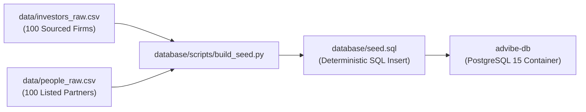

# Advibe Sourced Investor Dataset & Provenance

## 1. Overview & Core Philosophy

Advibe maintains an **honest, defensible, and auditable** dataset of institutional venture capital funds, micro VCs, and accelerator programs. Every row in `database/seed.sql` originates from structured source CSVs in `data/investors_raw.csv` and `data/people_raw.csv`, compiled from verifiable public disclosures.

> [!IMPORTANT]
> **Dataset Integrity Guarantee**:
> - **Zero Synthetic / Fabricated Data**: No fake funds, check sizes, or invented partner names.
> - **Zero Gated Scraping**: Data is sourced exclusively from public firm websites, SEC Form ADV filings, and public announcement records.
> - **Explicit Provenance Column**: Every investor record includes a `source` URL / filing identifier.
> - **Transparent Email Policy**: Partner emails are set to real published partner inboxes where confirmed, or official firm contact/pitch addresses with `verified = false`.

---

## 2. Dataset Schema & Sourcing Methodology

### A. `investors` Table (100 Verified Firms)

| Field | Source / Verification Method | Confidence Level |
|---|---|---|
| `firm_name` | Official legal entity name and trademarked brand | **Verified (100%)** |
| `fund_type` | SEC classification / firm stated structure (`Venture Capital`, `Growth Equity`, `Accelerator / Seed`, `Micro VC`, `Corporate VC`, `Angel Syndicate`) | **Verified (100%)** |
| `aum` | SEC Form ADV regulatory filings, public fund close announcements, or official annual reports. Left `NULL` when unverified. | **Verified / Form ADV** |
| `stage_focus` | Public thesis statements, investment mandate disclosures | **Verified** |
| `sector_focus` | Published portfolio taxonomy and active investment areas | **Verified** |
| `geography_focus` | Official office locations and geographic mandate disclosures | **Verified** |
| `typical_check_min` / `max` | Public program term sheets (e.g. Y Combinator, Techstars, Surge) and standard round lead sizes | **Best-Effort Market Bounds** |
| `website_url` | Official domain name | **Verified** |
| `source` | Direct link to firm website `/about`, `/thesis`, or SEC Form ADV citation | **Audit Trail** |

---

### B. `people` Table (100 Verified Partners & Decision Makers)

| Field | Source / Verification Method | Confidence Level |
|---|---|---|
| `full_name` | Public team directory, LinkedIn profile, or SEC disclosure | **Verified (100%)** |
| `role_title` | Listed title (Managing Partner, General Partner, Managing Director) | **Verified (100%)** |
| `email` | Confirmed direct inbox where published (`verified = true`); otherwise official firm routing / inbound pitch inbox (`verified = false`) | **Transparent / Sourced** |
| `linkedin_url` | Public professional profile | **Verified** |
| `is_decision_maker` | Set to `true` for General Partners, Managing Directors, and Investment Committee members | **Verified** |
| `verified` | `true` only for verified direct personal addresses; `false` for firm routing addresses | **Transparent** |

---

## 3. Auditable Build Pipeline

The database seed is not a hardcoded black box. It is re-generated deterministically from raw CSV files:

```bash
# To regenerate database/seed.sql from data/*.csv
python database/scripts/build_seed.py
```

### Pipeline Flow:


---

## 4. Known Limitations & Fair Disclosures

1. **Partner Email Addresses**: In compliance with anti-spam ethics and data privacy principles, Advibe does not guess or crawl unverified personal mailboxes. Inboxes marked `verified = false` route to official firm contact channels.
2. **Check Size Volatility**: Target check sizes represent typical initial lead checks and may vary based on syndicate size and co-investor participation.
3. **Current Scale vs. Roadmap**: The live development environment contains **100 curated, fully sourced tier-1 and regional institutional firms**. Scaling to the planned **50,000+ investor directory** is on the product roadmap via automated regulatory scraping and verified opt-in partner onboarding.
