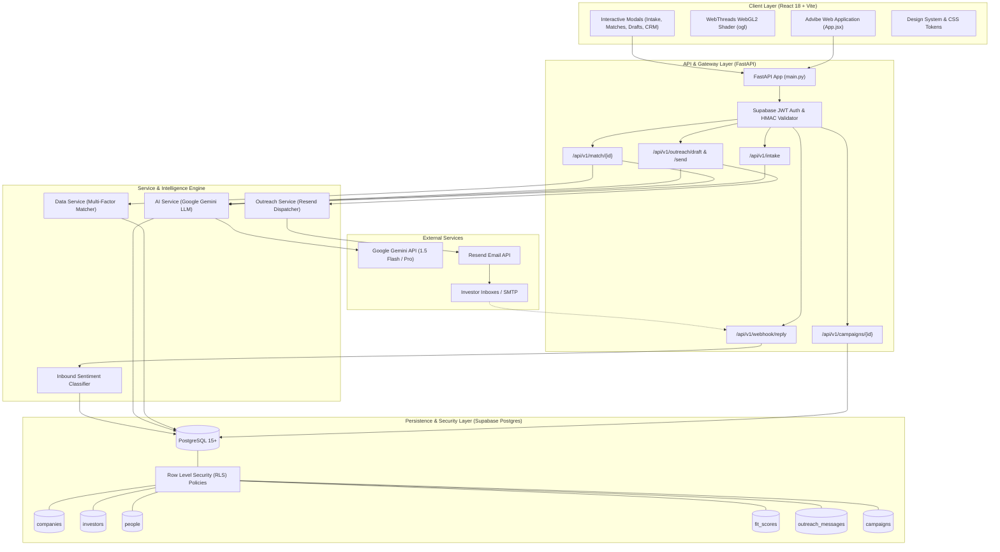
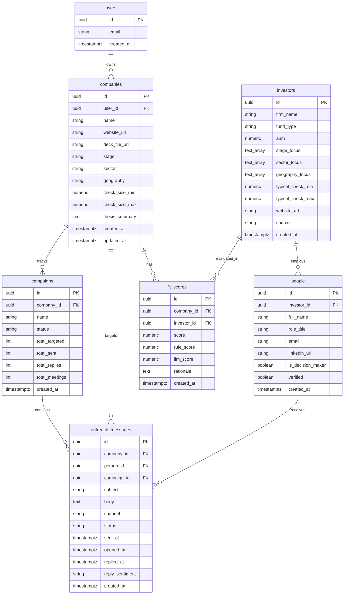
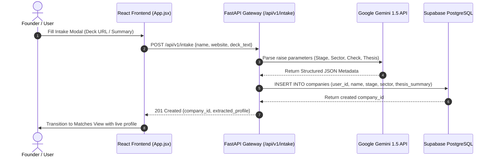
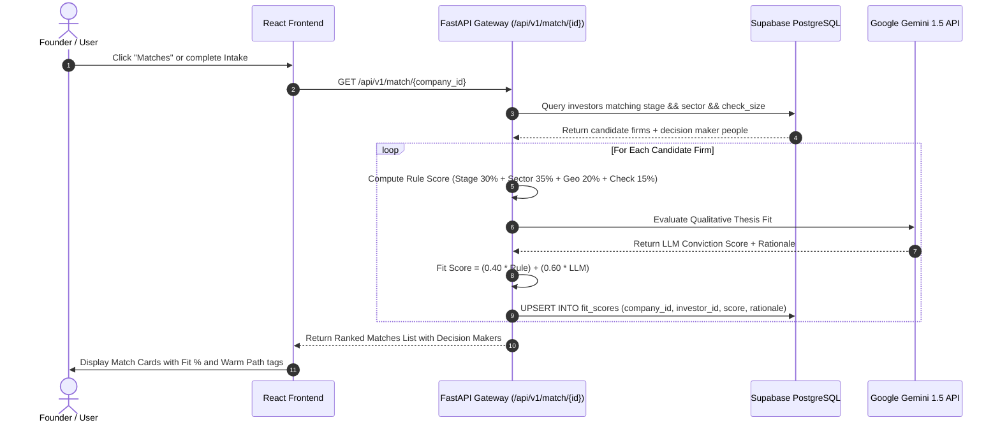
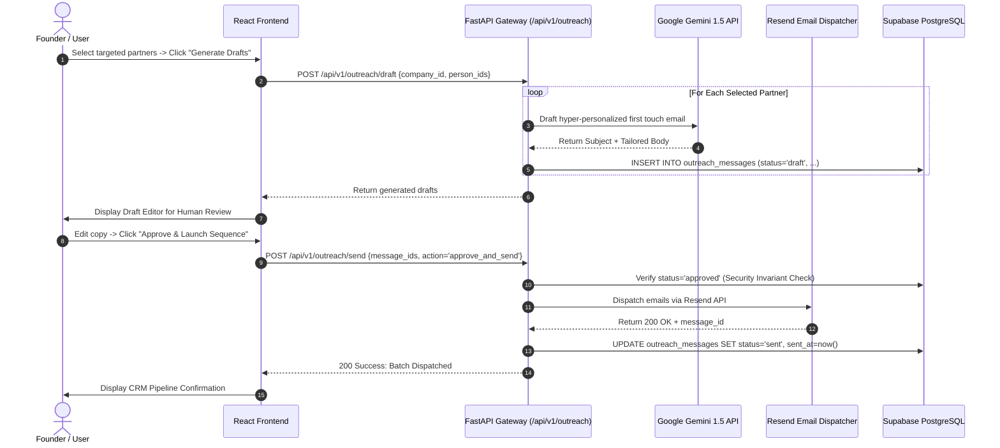
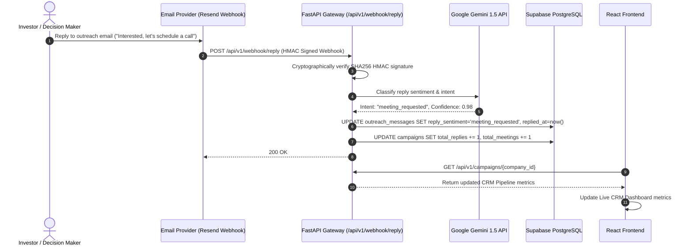

# Advibe — System Architecture (`architecture.md`)

This document provides the comprehensive technical architecture, component diagrams, data flows, and sequence diagrams for the **Advibe** AI Investor Discovery & Relationship Operating System.

---

## 1. High-Level System Architecture Diagram

---

## 2. Layer-by-Layer Architectural Breakdown

### 2.1 Client Layer (React 18 + Vite)
- **Framework**: React 18 with functional components and hooks (`useState`, `useEffect`, `useRef`).
- **Interactive Background**: `WebThreads.jsx` compiles a custom WebGL2 `#version 300 es` GLSL fragment shader rendering interactive sine threads that converge on user cursor coordinates.
- **State Flow**:
  - Modal overlay visibility state (`intake`, `matches`, `drafts`, `how`, `faqs`, `pricing`, `demo`).
  - Active company profile & raise metadata.
  - Multi-selection partner checkbox arrays.
  - Live draft editing state with human approval triggers.

### 2.2 API & Gateway Layer (FastAPI)
- **Entrypoint**: `backend/main.py` mounting modular APIRouters under `/api/v1`.
- **Authentication**: `app/core/auth.py` validating Supabase Bearer JWT tokens with tenant `user_id` injection into request dependencies (`Depends(get_current_user)`).
- **Validation**: Pydantic v2 domain schemas validating request bodies, query params, and JSON responses.
- **Structured Telemetry**: JSON loggers tracing `request_id`, execution duration, and endpoint latency.

### 2.3 Service & Intelligence Engine
- **AI Service (`ai_service.py` & `llm_client.py`)**:
  - **Multi-Provider Resilience**: Routes chat completions to **Groq** (`llama-3.3-70b-versatile`) as primary LPU provider and seamlessly falls through to **OpenRouter** (`deepseek/deepseek-r1`) upon 429 rate limits or outages with max 2 exponential backoff retries.
  - **Intake Parser (`extract_profile`)**: Extracts structured `IntakeProfile` parameters from raw pitch decks and website summaries with JSON mode and re-prompting.
  - **LLM Conviction Scorer (`score_conviction`)**: Generates qualitative alignment score ($0.0 - 1.0$) and a 2-3 sentence investment thesis rationale.
  - **Draft Synthesizer (`draft_outreach`)**: Composes contextual, high-signal first-touch emails referencing target partner sector focus and investment history.
  - **Fail-Safe Heuristic Layer**: Call-site deterministic fallbacks guarantee that intake, matching, and drafting never raise unhandled exceptions even during complete LLM network outages.
- **Multi-Factor Match Engine (`data_service.py`)**:
  - Executes deterministic SQL prefiltering using PostgreSQL array overlap operators (`&&`).
  - Calculates the weighted composite score:
    $$\text{Final Fit} = (0.40 \times \text{Rule Score}) + (0.60 \times \text{LLM Score})$$
- **Outreach Service (`outreach_service.py`)**:
  - **Enforces Security Invariant**: Verifies `status == 'approved'` prior to calling Resend.
  - Updates campaign delivery metrics and logs message hashes.

### 2.4 Persistence & Security Layer (PostgreSQL 15 / Supabase)
- **Deployment Options**: Runs either as a self-hosted containerized database (`postgres:15-alpine` via `docker compose up -d`) or managed via Supabase.
- **RLS Isolation**: Scopes all tenant operations on `companies`, `fit_scores`, `messages`, and `campaigns` to `public.current_user_id() = user_id`.
  - In self-hosted Postgres, the FastAPI backend sets the session variable: `SET LOCAL app.current_user_id = '<user-uuid>'`.
  - In Supabase, fallback transparently accesses session settings.
- **GIN Indexing**: Indexes `stage_focus`, `sector_focus`, and `geography_focus` for sub-second filtering over 100+ sourced investor records in the current dataset (audited in `DATA_SOURCES.md`, designed to scale to 50,000+).
- **Data Integrity**: Foreign key cascades with automated `set_updated_at()` trigger execution on mutable records.

---

## 3. Database Entity-Relationship Diagram (ERD)

---

## 4. End-to-End Sequence Diagrams

### 4.1 Pitch Deck Intake & Thesis Extraction Flow

### 4.2 Dual-Factor Investor Matching Flow

### 4.3 Human-in-the-Loop Outreach & Dispatch Flow

### 4.4 Inbound Reply Classification & Closed-Loop CRM Flow

